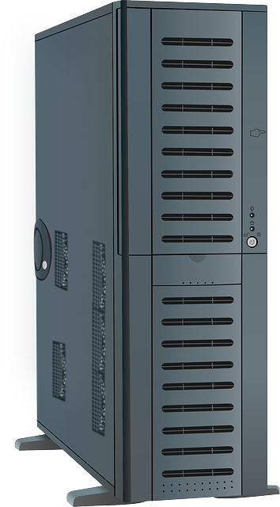

<h1 align="center">CASE</h1>

    

       
Case is a protection that covers all the parts  
There are various in size, so you need to check if the case you would like to buy supports the mainboard you are using

   
- [MB(Main Board)](https://github.com/jjthd/JjthdFianlProject/blob/main/MB.md)
- [CPU](https://github.com/jjthd/JjthdFianlProject/blob/main/CPU.md)
- [RAM](https://github.com/jjthd/JjthdFianlProject/blob/main/RAM.md)
- [HDD(Hard Disk Drive)](https://github.com/jjthd/JjthdFianlProject/blob/main/HDD.md)
- [GPU(Graphic Card)](https://github.com/jjthd/JjthdFianlProject/blob/main/GPU.md)
- [PSU(Power Supply)](https://github.com/jjthd/JjthdFianlProject/blob/main/PSU.md)

