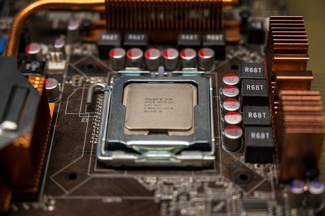

<h1 align="center">CPU</h1>

    

       
CPU is a brain of your computer  
There two brands that produce CPUs which are intel and AMD  
CPU with higher numbers are better than the lowers  
i.e i5-6500 < i7-6500 
  ryzen 2600 < 2700
 

   
- [MB(Main Board)](https://github.com/jjthd/JjthdFianlProject/blob/main/MB.md)
- [RAM](https://github.com/jjthd/JjthdFianlProject/blob/main/RAM.md)
- [HDD(Hard Disk Drive)](https://github.com/jjthd/JjthdFianlProject/blob/main/HDD.md)
- [GPU(Graphic Card)](https://github.com/jjthd/JjthdFianlProject/blob/main/GPU.md)
- [PSU(Power Supply)](https://github.com/jjthd/JjthdFianlProject/blob/main/PSU.md)
- [Case](https://github.com/jjthd/JjthdFianlProject/blob/main/CASE.md)

