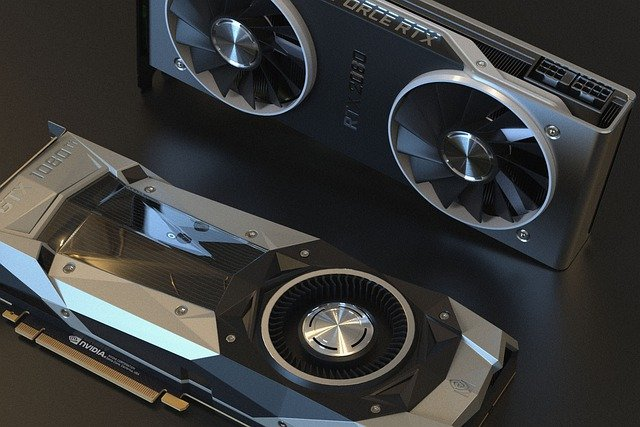

<h1 align="center">GPU</h1>

    

       
GPU is  the part that works for the graphics  
Everything that you think is related to graphics, GPU takes care of it mostly  
i.e  Video games with high quality graphic works require high quality GPU

   
- [MB(Main Board)](https://github.com/jjthd/JjthdFianlProject/blob/main/MB.md)
- [CPU](https://github.com/jjthd/JjthdFianlProject/blob/main/CPU.md)
- [RAM](https://github.com/jjthd/JjthdFianlProject/blob/main/RAM.md)
- [HDD(Hard Disk Drive)](https://github.com/jjthd/JjthdFianlProject/blob/main/HDD.md)
- [GPU(Graphic Card)](https://github.com/jjthd/JjthdFianlProject/blob/main/GPU.md)
- [PSU(Power Supply)](https://github.com/jjthd/JjthdFianlProject/blob/main/PSU.md)
- [Case](https://github.com/jjthd/JjthdFianlProject/blob/main/CASE.md)

