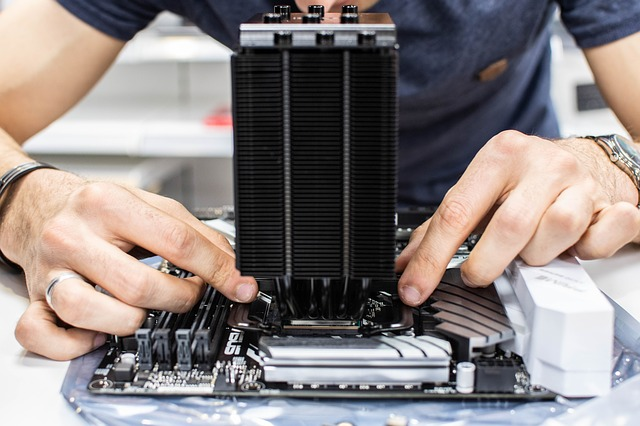

<h1 align="center">PSU</h1>

    

       
PSU is a part that supply power to your computer

   
- [MB(Main Board)](https://github.com/jjthd/JjthdFianlProject/blob/main/MB.md)
- [CPU](https://github.com/jjthd/JjthdFianlProject/blob/main/CPU.md)
- [RAM](https://github.com/jjthd/JjthdFianlProject/blob/main/RAM.md)
- [HDD(Hard Disk Drive)](https://github.com/jjthd/JjthdFianlProject/blob/main/HDD.md)
- [GPU(Graphic Card)](https://github.com/jjthd/JjthdFianlProject/blob/main/GPU.md)
- [Case](https://github.com/jjthd/JjthdFianlProject/blob/main/CASE.md)

