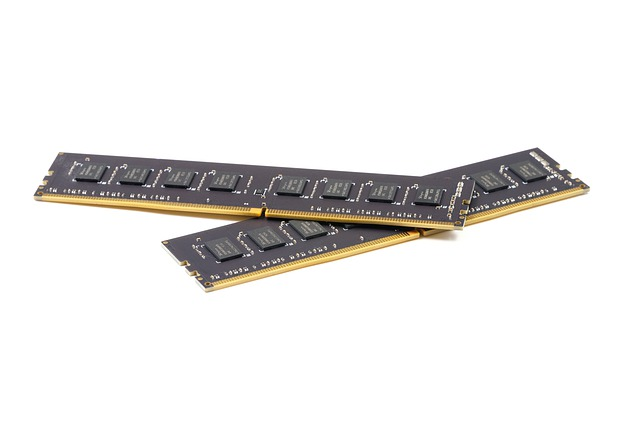

<h1 align="center">RAM</h1>

    

       
  This is a memory that your computer holds when the power goes into it  
  The memory stored in RAM gets erased when power supply gets disconnected

   
- [MB(Main Board)](https://github.com/jjthd/JjthdFianlProject/blob/main/MB.md)
- [CPU](https://github.com/jjthd/JjthdFianlProject/blob/main/CPU.md)
- [HDD(Hard Disk Drive)](https://github.com/jjthd/JjthdFianlProject/blob/main/HDD.md)
- [GPU(Graphic Card)](https://github.com/jjthd/JjthdFianlProject/blob/main/GPU.md)
- [PSU(Power Supply)](https://github.com/jjthd/JjthdFianlProject/blob/main/PSU.md)
- [Case](https://github.com/jjthd/JjthdFianlProject/blob/main/CASE.md)
- [Homepage](https://github.com/jjthd/JjthdFianlProject/blob/main/README.md)

