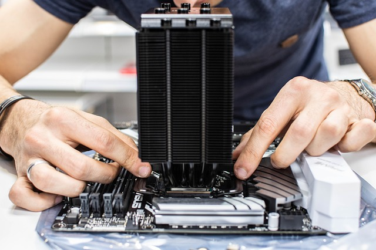

<h1 align="center">Information about PC parts</h1>

  <h3 align="right">Author: Jihwan Jeong</h3>

    

       This project will briefly go over with the parts that you need for your PC, what are they and what they do.  
 For all the people who are trying to build their computers themselves but not familiar with computer parts.

   
- [CPU](https://github.com/jjthd/JjthdMarkdownPage/blob/FirstInterest/README.md)
- [HDD(Hard Disk Drive)](https://github.com/jjthd/JjthdMarkdownPage/blob/FirstInterest/README.md)
- [RAM](https://github.com/jjthd/JjthdMarkdownPage/blob/FirstInterest/README.md)
- [GPU(Graphic Card)](https://github.com/jjthd/JjthdMarkdownPage/blob/FirstInterest/README.md)
- [PWD(Power Supply)](https://github.com/jjthd/JjthdMarkdownPage/blob/FirstInterest/README.md)
- [MB(Main Board)](https://github.com/jjthd/JjthdMarkdownPage/blob/FirstInterest/README.md)
- [Case](https://github.com/jjthd/JjthdMarkdownPage/blob/FirstInterest/README.md)
